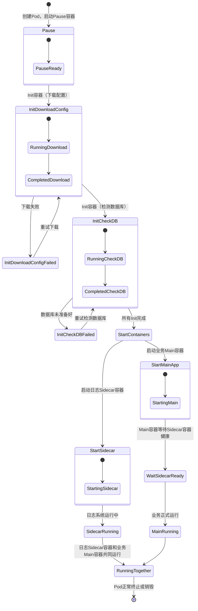

## Init 容器 & Pause/Infra 容器

```mermaid
stateDiagram-v2
    [*] --> Pause: 创建Pod，启动Pause容器
    Pause --> InitDownloadConfig: Init容器（下载配置）
    InitDownloadConfig --> InitDownloadConfigFailed: 下载失败
    InitDownloadConfigFailed --> InitDownloadConfig: 重试下载

    InitDownloadConfig --> InitCheckDB: Init容器（检测数据库）
    InitCheckDB --> InitCheckDBFailed: 数据库未准备好
    InitCheckDBFailed --> InitCheckDB: 重试检测数据库

    InitCheckDB --> StartContainers: 所有Init完成

    StartContainers --> StartSidecar: 启动日志Sidecar容器
    StartContainers --> StartMainApp: 启动业务Main容器

    StartSidecar --> SidecarRunning: 日志系统运行中
    StartMainApp --> WaitSidecarReady: Main容器等待Sidecar容器健康
    WaitSidecarReady --> MainRunning: 业务正式运行

    SidecarRunning --> RunningTogether: 日志Sidecar容器和业务Main容器共同运行
    MainRunning --> RunningTogether

    RunningTogether --> [*]: Pod正常终止或销毁

    state Pause {
        [*] --> PauseReady
    }
    state InitDownloadConfig {
        [*] --> RunningDownload
        RunningDownload --> CompletedDownload
    }
    state InitCheckDB {
        [*] --> RunningCheckDB
        RunningCheckDB --> CompletedCheckDB
    }
    state StartSidecar {
        [*] --> StartingSidecar
    }
    state StartMainApp {
        [*] --> StartingMain
    }

```