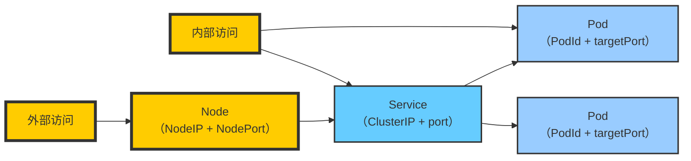

## 三种IP

## 概念

### `Pod IP` —— Pod 的「身份证」

Pod IP 是每个Pod的卫P地址，它是Docker Engine 根据docker0网桥的P 地址段进 行分配的，通常是 一个虚拟的二层网络，前面我们说过，Kubernetes 要求位于不同 Node 上的 Pod 能够彼此直接通信，所以 Kuber netes 里一 个Pod 里的容器访问另外一 个Pod 里的容器，就 是通过Pod IP 所在的虚拟二层网络进行通信的，而真实的TCP/P 流量则是通过NodeIP所在的 物 理 网 卡流 出 的 。

### 定义：

- 每个 Pod 启动时会被分配一个 IP，这个 IP 是在 Kubernetes 网络范围内的。
- **通常由 CNI 插件（如 Flannel、Calico、Cilium 等）自动分配**。

### 特点：

- 每个 Pod 的 IP 是唯一的（集群内）。
- **生命周期=Pod 生命周期**，Pod 一旦销毁，IP 就失效。
- **仅集群内部可访问**，外部无法直接访问 Pod IP。

### 使用场景：

- Pod 间直接通信。

---

### `Cluster IP` —— Service 的统一入口

### 定义：

- 是 Kubernetes `Service` 自动分配的一个虚拟 IP（默认类型为 `ClusterIP`）。
- 用来将集群内部的请求 **负载均衡** 到后端多个 Pod 上。

`Service`对象的`IP`地址（可称为`ClusterIP`或`ServiceIP`）是虚拟`IP`地址，由`Kubernetes`系统在`Service`对象创建时在专用网络（`Service Network`）地址中自动分配或由用户手动指定，并且在`Service`对象的生命周期中保持不变。

`Service`基于端口过滤到达其IP地址的客户端请求，并根据定义将请求转发至其后端的`Pod`对象的相应端口之上，因此这种代理机制也称为“端口代理”或四层代理，工作于`TCP/IP`协议栈的传输层。 

`Service`对象会通过`API Server`持续监视（`watch`）标签选择器匹配到的后端`Pod`对象，并实时跟踪这些`Pod`对象的变动情况，例如：`IP`地址变动以及`Pod`对象的增加或删除等。

不过，`Service`并不直接连接至`Pod`对象，它们之间还有一个中间层——`Endpoints`资源对象，该资源对象是一个由`IP`地址和端口组成的列表，这些`IP`地址和端口则来自由`Service`的标签选择器匹配到的`Pod`对象。默认情况下，创建Service资源对象时，其关联的Endpoints对象会被自动创建。

### 特点：

- 对于调用方（其他 Pod）来说，这是访问某个服务的 **固定地址**。
- **不会随着 Pod 更换而变化**（稳定）。
- **仅集群内可访问**，无法从集群外直接访问。

### 使用场景：

- 服务间调用（如前端 Pod 调用后端 Service）。

---

### `Node IP` —— 集群的出口/入口

NodeIP是Kubernetes集群中每个节点的物理网卡的IP地址，这是一个真实存在的物理冈络，所有属于这个网络的服务器之间都能通过这个网络直接通信，不管它们中是否有部分节点不属于这个Kubernetes集群。这也表明了Kubernetes集群之外的节点访问区ubernetes集群之内的某个节点或者TCP/IP服务的时候，必须要通过NodeIP进行通信。

### 定义：

- 宿主机（Node）的网络 IP，通常是你机器在内网或公网的 IP。
- 在 `Service` 类型为 `NodePort` 或 `LoadBalancer` 时起作用。

### 特点：

- 可被外部访问，适合暴露给集群外部用户。
- 所有 Node 都监听一个端口，对应后端 Service。

### 使用场景：

- 用户访问系统，如：浏览器访问 Web 页面。

---

## 三种 IP 之间的关系图解：

