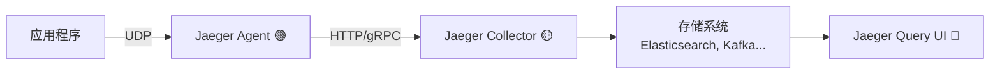

# Jaeger

| 组件 | 作用 |
| --- | --- |
| **Jaeger Agent** | 接收应用发来的 span（UDP），**中转** 到 Collector |
| **Jaeger Collector** | 接收 Agent 发来的 span，**存储** 到后端（Elasticsearch 等） |
| **Jaeger Query** | 提供 **UI 和 API** 查询 trace 数据，供你“看” trace 用的 |

---

## 🧩 三者角色与关系

---

## 🔍 详细对比

| 组件名 | 职责 | 运行位置 | 通信方式 | 对开发者的作用 |
| --- | --- | --- | --- | --- |
| **Agent** | 本地收集 span，转发到 Collector | 通常每台机器一个 | 接收 UDP，发 HTTP/gRPC | 应用只发给本地 Agent，低开销 |
| **Collector** | 接收 span，做预处理，然后写入后端存储（Elasticsearch、Kafka 等） | 可以集中部署 | HTTP/gRPC | 把 trace 数据写入可查询的存储 |
| **Query** | 提供 Web UI（16686）和 API 查询 | 一般一台就够 | 从存储中查 | 查看 trace 的界面，前端展示 |

---

## 🧪 示例端口

| 组件 | 默认端口 | 描述 |
| --- | --- | --- |
| Agent | `6831/udp` | 接收 UDP span |
| Collector | `14268/http`, `14250/grpc` | 接收 span（来自 Agent 或 App） |
| Query | `16686` | Web UI 和 API |

## 两种模式对比

| 模式 | 应用 ➝ Jaeger Agent ➝ Collector | 应用 ➝ Collector（直连） |
| --- | --- | --- |
| **网络协议** | UDP ➝ Agent，Agent ➝ HTTP/gRPC | 应用 ➝ HTTP/gRPC 直发 |
| **优点** | ✅ 低开销（UDP）✅ 本地中转避免 Collector 连接过多✅ 支持批量转发 | ✅ 更简单（少一个组件）✅ 适合本地开发或轻量部署 |
| **缺点** | ❌ 多部署一个 Agent 守护进程（每台机器或每个 Pod） | ❌ 高并发时每个服务都连 Collector，连接数暴涨❌ 每个服务自己管理导出逻辑，增加耦合 |
| **可靠性** | ✅ Agent 有缓冲和批处理，Collector 压力小 | ❌ Collector 容易被打爆❌ 应用网络抖动直接影响导出 |
| **适用场景** | 🚀 正式环境（大规模服务部署） | 🧪 本地开发、小型服务、容器内运行 all-in-one |

# 附录

[Introduction](https://www.jaegertracing.io/docs/1.34/)