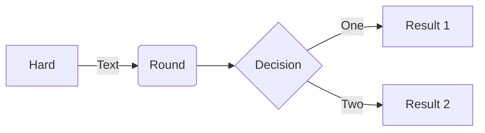
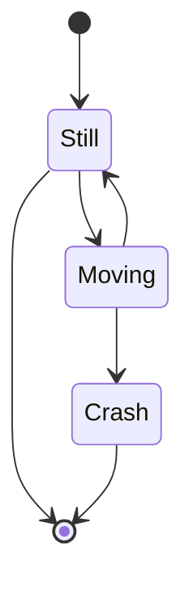
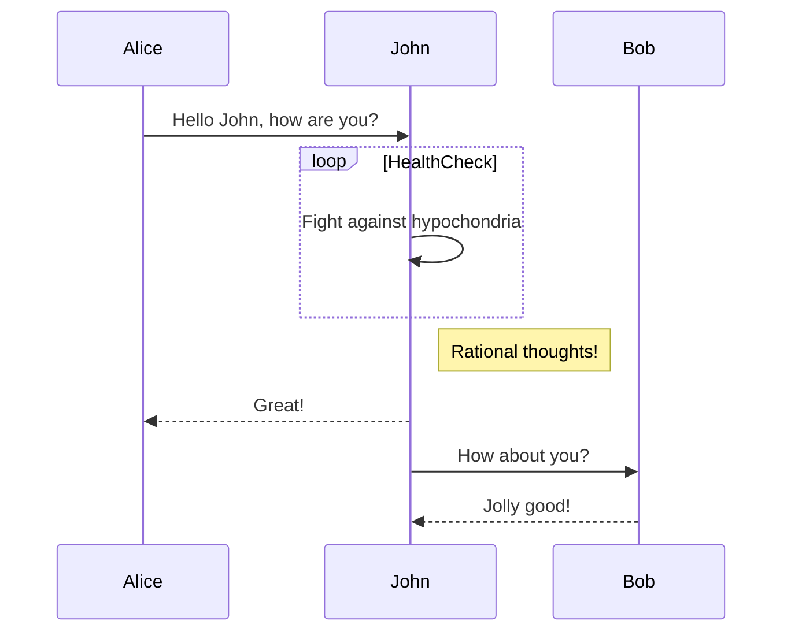

## Mermaid

## 概述

Mermaid 是一款基于 JavaScript 的图表和制图工具，它使用 Markdown 风格的文本定义和渲染器来创建和修改复杂的图表。Mermaid 的主要目的是帮助文档跟上开发的步伐。
以下是 Mermaid 支持的一些主要图表类型：
• 流程图 (`Flowchart`)
• 序列图 (`Sequence Diagram`)
• 类图 (`Class Diagram`)
• 状态图 (`State Diagram`)
• 实体关系图 (`Entity Relationship Diagram, ERD`)
• 甘特图 (`Gantt Diagram`)
• 饼图 (`Pie Chart`)
• 用户旅程图 (`User Journey Diagram`)
• Git 图 (`Git Graph`)
• 需求图 (`Requirement Diagram`)

## 集成

浏览器集成

```html
<div class="mermaid">
 graph LR
    A[需求评审] --> B(技术设计)
    B --> C{复杂度评估}
    C -->|高| D[拆分任务]
    C -->|低| E[直接开发]
</div>
<script src="https://cdn.jsdelivr.net/npm/mermaid@10.0.0/dist/mermaid.min.js"></script>
```

## 示例

### **流程图**



### 状态图



### **序列图**



## 附录

[GitHub - mermaid-js/mermaid: Generation of diagrams like flowcharts or sequence diagrams from text in a similar manner as markdown](https://github.com/mermaid-js/mermaid)