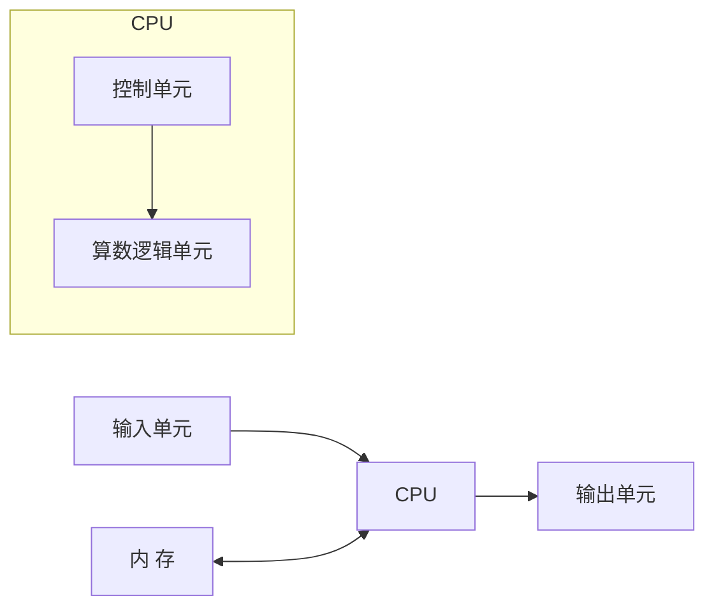

# 未命名

五大部分：输入单元、 输出单元、CPU 内部的控制单元、算数逻辑单元与内存

```mermaid
graph LR

输入单元[输入单元]
输出单元[输出单元] 
内存[内 存] 

subgraph CPU 
控制单元[控制单元]
ALU[算数逻辑单元] 
end 

输入单元 --> CPU 
控制单元 --> ALU 
内存 <--> CPU 
CPU --> 输出单元
```
